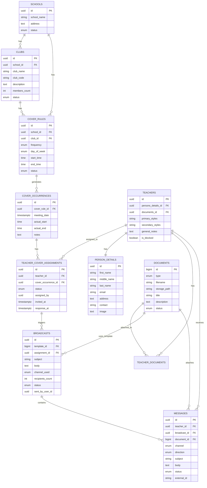

## Overview

ClubConnect UK uses **PostgreSQL** via Supabase with a comprehensive schema designed to manage schools, clubs, teachers, cover assignments, and messaging. The database includes Row-Level Security (RLS) policies for secure data access.

## Schema Migrations

The database schema is managed through SQL migrations located in `supabase/migrations/`:

- `20250101000000_initial_schema.sql` - Core schema and tables
- `20250101000001_rls_policies.sql` - Row-level security policies
- `20251224000000_clubs_enhancements.sql` - Additional club features

## Database Tables

### Person Details

Stores personal information for teachers and other individuals.

```sql
CREATE TABLE public.person_details (
    id UUID PRIMARY KEY DEFAULT gen_random_uuid(),
    first_name VARCHAR(255) NOT NULL,
    middle_name VARCHAR(255),
    last_name VARCHAR(255) NOT NULL,
    email VARCHAR(255),
    address TEXT,
    contact VARCHAR(100),
    image TEXT,
    created_at TIMESTAMPTZ DEFAULT NOW() NOT NULL,
    updated_at TIMESTAMPTZ DEFAULT NOW() NOT NULL
);
```

**TypeScript Type:**

```typescript src/types/teacher.types.ts
export interface PersonDetails {
  id: string
  first_name: string
  middle_name?: string | null
  last_name: string
  email?: string | null
  address?: string | null
  contact?: string | null
  image?: string | null
  created_at: string
  updated_at: string
}
```

### Schools

Schools that host clubs and activities.

```sql
CREATE TABLE public.schools (
    id UUID PRIMARY KEY DEFAULT gen_random_uuid(),
    school_name VARCHAR(255) NOT NULL,
    address TEXT,
    status public.school_status DEFAULT 'active' NOT NULL,
    created_at TIMESTAMPTZ DEFAULT NOW() NOT NULL,
    updated_at TIMESTAMPTZ DEFAULT NOW() NOT NULL
);
```

**TypeScript Type:**

```typescript src/types/club.types.ts
export interface School {
  id: string
  school_name: string
  address?: string | null
  status: 'active' | 'inactive' | 'pending'
  created_at: string
  updated_at: string
}
```

**Status Enum:**
```sql
CREATE TYPE public.school_status AS ENUM ('active', 'inactive', 'pending');
```

### Clubs

Clubs and activities organized by schools.

```sql
CREATE TABLE public.clubs (
    id UUID PRIMARY KEY DEFAULT gen_random_uuid(),
    school_id UUID NOT NULL REFERENCES public.schools(id) ON DELETE CASCADE,
    club_name VARCHAR(255) NOT NULL,
    club_code VARCHAR(50) NOT NULL,
    description TEXT,
    members_count INTEGER DEFAULT 0,
    status public.cover_status DEFAULT 'active',
    created_at TIMESTAMPTZ DEFAULT NOW() NOT NULL,
    updated_at TIMESTAMPTZ DEFAULT NOW() NOT NULL
);
```

**TypeScript Type:**

```typescript src/types/club.types.ts
export type ClubStatus = 'active' | 'inactive' | 'cancelled'

export interface Club {
  id: string
  school_id: string
  club_name: string
  category?: string
  club_code: string
  description?: string | null
  members_count: number
  status: ClubStatus
  created_at: string
  updated_at: string
  school?: School
}
```

### Teachers

Teachers who can be assigned to cover clubs.

```sql
CREATE TABLE public.teachers (
    id UUID PRIMARY KEY DEFAULT gen_random_uuid(),
    persons_details_id UUID NOT NULL REFERENCES public.person_details(id) ON DELETE CASCADE,
    documents_id UUID,
    primary_styles VARCHAR(255),
    secondary_styles VARCHAR(255),
    general_notes TEXT,
    is_blocked BOOLEAN DEFAULT FALSE NOT NULL,
    created_at TIMESTAMPTZ DEFAULT NOW() NOT NULL,
    updated_at TIMESTAMPTZ DEFAULT NOW() NOT NULL
);
```

**TypeScript Type:**

```typescript src/types/teacher.types.ts
export interface Teacher {
  id: string
  persons_details_id: string
  documents_id?: string | null
  primary_styles?: string | null
  secondary_styles?: string | null
  general_notes?: string | null
  is_blocked: boolean
  created_at: string
  updated_at: string
  person_details: PersonDetails
}
```

### Documents

Stores file metadata for teacher documents and templates.

```sql
CREATE TABLE public.documents (
    id BIGSERIAL PRIMARY KEY,
    type public.document_type NOT NULL,
    filename VARCHAR(255) NOT NULL,
    storage_path VARCHAR(512) NOT NULL,
    title VARCHAR(255),
    description TEXT,
    status public.document_status DEFAULT 'active' NOT NULL,
    created_at TIMESTAMPTZ DEFAULT NOW() NOT NULL,
    updated_at TIMESTAMPTZ DEFAULT NOW() NOT NULL
);
```

**Document Type Enum:**
```sql
CREATE TYPE public.document_type AS ENUM ('teacher_file', 'system_template', 'sent_attachment');
```

**Document Status Enum:**
```sql
CREATE TYPE public.document_status AS ENUM ('active', 'archived', 'deleted');
```

### Teacher Documents (Junction Table)

Many-to-many relationship between teachers and documents.

```sql
CREATE TABLE public.teacher_documents (
    teacher_id UUID NOT NULL REFERENCES public.teachers(id) ON DELETE CASCADE,
    document_id BIGINT NOT NULL REFERENCES public.documents(id) ON DELETE CASCADE,
    PRIMARY KEY (teacher_id, document_id)
);
```

### Cover Rules

Defines recurring schedules for clubs.

```sql
CREATE TABLE public.cover_rules (
    id UUID PRIMARY KEY DEFAULT gen_random_uuid(),
    school_id UUID NOT NULL REFERENCES public.schools(id) ON DELETE CASCADE,
    club_id UUID NOT NULL REFERENCES public.clubs(id) ON DELETE CASCADE,
    frequency public.frequency_type NOT NULL DEFAULT 'weekly',
    day_of_week public.day_of_week NOT NULL,
    start_time TIME NOT NULL,
    end_time TIME NOT NULL,
    status public.cover_status DEFAULT 'active' NOT NULL,
    created_at TIMESTAMPTZ DEFAULT NOW() NOT NULL,
    updated_at TIMESTAMPTZ DEFAULT NOW() NOT NULL
);
```

**TypeScript Type:**

```typescript src/types/club.types.ts
export type CoverFrequency = 'weekly' | 'bi-weekly' | 'monthly'
export type DayOfWeek =
  | 'monday'
  | 'tuesday'
  | 'wednesday'
  | 'thursday'
  | 'friday'
  | 'saturday'
  | 'sunday'
export type CoverRuleStatus = 'active' | 'inactive' | 'cancelled'

export interface CoverRule {
  id: string
  school_id: string
  club_id: string
  frequency: CoverFrequency
  day_of_week: DayOfWeek
  start_time: string
  end_time: string
  status: CoverRuleStatus
  created_at: string
  updated_at: string
  club?: Club
  school?: School
}
```

**Frequency Enum:**
```sql
CREATE TYPE public.frequency_type AS ENUM ('weekly', 'bi-weekly', 'monthly');
```

**Day of Week Enum:**
```sql
CREATE TYPE public.day_of_week AS ENUM ('monday', 'tuesday', 'wednesday', 'thursday', 'friday', 'saturday', 'sunday');
```

### Cover Occurrences

Specific instances of club meetings generated from cover rules.

```sql
CREATE TABLE public.cover_occurrences (
    id UUID PRIMARY KEY DEFAULT gen_random_uuid(),
    cover_rule_id UUID NOT NULL REFERENCES public.cover_rules(id) ON DELETE CASCADE,
    meeting_date TIMESTAMPTZ NOT NULL,
    actual_start TIME,
    actual_end TIME,
    notes TEXT,
    created_at TIMESTAMPTZ DEFAULT NOW() NOT NULL,
    updated_at TIMESTAMPTZ DEFAULT NOW() NOT NULL
);
```

**TypeScript Type:**

```typescript src/types/club.types.ts
export type OccurrenceStatus = 'not_started' | 'in_progress' | 'completed'
export type Priority = 'low' | 'medium' | 'high'

export interface CoverOccurrence {
  id: string
  cover_rule_id: string
  meeting_date: string
  actual_start?: string | null
  actual_end?: string | null
  notes?: string | null
  status: OccurrenceStatus
  priority: Priority
  created_at: string
  updated_at: string
  cover_rule?: CoverRule
  assignments?: Array<TeacherCoverAssignment>
}
```

### Teacher Cover Assignments

Assigns teachers to specific cover occurrences.

```sql
CREATE TABLE public.teacher_cover_assignments (
    id UUID PRIMARY KEY DEFAULT gen_random_uuid(),
    teacher_id UUID NOT NULL REFERENCES public.teachers(id) ON DELETE CASCADE,
    cover_occurrence_id UUID NOT NULL REFERENCES public.cover_occurrences(id) ON DELETE CASCADE,
    status public.assignment_status DEFAULT 'pending' NOT NULL,
    assigned_by UUID,
    invited_at TIMESTAMPTZ,
    response_at TIMESTAMPTZ,
    created_at TIMESTAMPTZ DEFAULT NOW() NOT NULL
);
```

**TypeScript Type:**

```typescript src/types/club.types.ts
export type AssignmentStatus =
  | 'invited'
  | 'accepted'
  | 'declined'
  | 'pending'
  | 'confirmed'

export interface TeacherCoverAssignment {
  id: string
  teacher_id: string
  cover_occurrence_id: string
  status: AssignmentStatus
  assigned_by?: string | null
  invited_at?: string | null
  response_at?: string | null
  created_at: string
  teacher?: Teacher
}
```

**Assignment Status Enum:**
```sql
CREATE TYPE public.assignment_status AS ENUM ('invited', 'accepted', 'declined', 'pending', 'confirmed');
```

### Broadcasts

Mass messages sent to multiple teachers.

```sql
CREATE TABLE public.broadcasts (
    id UUID PRIMARY KEY DEFAULT gen_random_uuid(),
    template_id BIGINT REFERENCES public.documents(id) ON DELETE SET NULL,
    assignment_id UUID REFERENCES public.teacher_cover_assignments(id) ON DELETE SET NULL,
    subject VARCHAR(255),
    body TEXT,
    channel_used public.broadcast_channel NOT NULL,
    recipients_count INTEGER DEFAULT 0 NOT NULL,
    status public.broadcast_status DEFAULT 'draft' NOT NULL,
    sent_by_user_id UUID,
    created_at TIMESTAMPTZ DEFAULT NOW() NOT NULL
);
```

**Broadcast Channel Enum:**
```sql
CREATE TYPE public.broadcast_channel AS ENUM ('sms', 'email', 'all');
```

**Broadcast Status Enum:**
```sql
CREATE TYPE public.broadcast_status AS ENUM ('draft', 'sending', 'completed', 'failed');
```

### Messages

Individual messages sent to teachers.

```sql
CREATE TABLE public.messages (
    id UUID PRIMARY KEY DEFAULT gen_random_uuid(),
    teacher_id UUID NOT NULL REFERENCES public.teachers(id) ON DELETE CASCADE,
    broadcast_id UUID REFERENCES public.broadcasts(id) ON DELETE SET NULL,
    document_id BIGINT REFERENCES public.documents(id) ON DELETE SET NULL,
    channel public.message_channel NOT NULL,
    direction public.message_direction NOT NULL,
    subject VARCHAR(255),
    body TEXT,
    status public.message_status DEFAULT 'sent' NOT NULL,
    external_id VARCHAR(255),
    created_at TIMESTAMPTZ DEFAULT NOW() NOT NULL,
    updated_at TIMESTAMPTZ DEFAULT NOW() NOT NULL
);
```

**Message Enums:**
```sql
CREATE TYPE public.message_channel AS ENUM ('sms', 'email');
CREATE TYPE public.message_direction AS ENUM ('outbound', 'inbound');
CREATE TYPE public.message_status AS ENUM ('sent', 'delivered', 'opened', 'replied', 'failed');
```

## Entity Relationship Diagram



## Database Relationships

### One-to-Many Relationships

| Parent Table | Child Table | Description |
|--------------|-------------|-------------|
| `schools` | `clubs` | A school has many clubs |
| `schools` | `cover_rules` | A school has many cover rules |
| `clubs` | `cover_rules` | A club has many cover rules |
| `cover_rules` | `cover_occurrences` | A cover rule generates many occurrences |
| `cover_occurrences` | `teacher_cover_assignments` | An occurrence has many assignments |
| `teachers` | `teacher_cover_assignments` | A teacher has many assignments |
| `teachers` | `messages` | A teacher receives many messages |
| `broadcasts` | `messages` | A broadcast contains many messages |

### Many-to-Many Relationships

| Table 1 | Junction Table | Table 2 | Description |
|---------|---------------|---------|-------------|
| `teachers` | `teacher_documents` | `documents` | Teachers can have multiple documents |

## Auto-Update Triggers

All tables have triggers to automatically update the `updated_at` timestamp:

```sql
CREATE OR REPLACE FUNCTION public.handle_updated_at()
RETURNS TRIGGER AS $$
BEGIN
    NEW.updated_at = NOW();
    RETURN NEW;
END;
$$ LANGUAGE plpgsql;

CREATE TRIGGER on_person_details_updated
    BEFORE UPDATE ON public.person_details
    FOR EACH ROW
    EXECUTE FUNCTION public.handle_updated_at();
```

## Database Indexes

Performance indexes are created for frequently queried columns:

```sql
CREATE INDEX idx_person_details_last_name ON public.person_details(last_name);
CREATE INDEX idx_schools_status ON public.schools(status);
CREATE INDEX idx_clubs_school_id ON public.clubs(school_id);
CREATE INDEX idx_teachers_person_id ON public.teachers(persons_details_id);
CREATE INDEX idx_cover_occurrences_date ON public.cover_occurrences(meeting_date);
CREATE INDEX idx_messages_status ON public.messages(status);
```

## Row-Level Security (RLS)

All tables have RLS enabled for secure data access.

### Example Policies

**Service Role (Full Access):**
```sql
CREATE POLICY "Service role can manage teachers"
    ON public.teachers
    FOR ALL
    TO service_role
    USING (true)
    WITH CHECK (true);
```

**Authenticated Users (Read Access):**
```sql
CREATE POLICY "Authenticated users can view non-blocked teachers"
    ON public.teachers
    FOR SELECT
    TO authenticated
    USING (is_blocked = false);
```

**Authenticated Users (Manage Access):**
```sql
CREATE POLICY "Authenticated users can manage schools"
    ON public.schools
    FOR ALL
    TO authenticated
    USING (true)
    WITH CHECK (true);
```

<Note>
  RLS policies are defined in `supabase/migrations/20250101000001_rls_policies.sql`
</Note>

## Applying Migrations

To apply the database schema:

```bash
# Link to your Supabase project
supabase link --project-ref your-project-ref

# Apply all migrations
supabase db push
```

Or using npx (no installation):

```bash
npx supabase link --project-ref your-project-ref
npx supabase db push
```

## Common Queries

### Get All Active Clubs with School Info

```typescript
const { data: clubs } = await supabase
  .from('clubs')
  .select(`
    *,
    school:schools(*)
  `)
  .eq('status', 'active')
```

### Get Teacher with Person Details

```typescript
const { data: teacher } = await supabase
  .from('teachers')
  .select(`
    *,
    person_details(*)
  `)
  .eq('id', teacherId)
  .single()
```

### Get Cover Occurrences with Assignments

```typescript
const { data: occurrences } = await supabase
  .from('cover_occurrences')
  .select(`
    *,
    cover_rule(*),
    assignments:teacher_cover_assignments(
      *,
      teacher(*)
    )
  `)
  .gte('meeting_date', new Date().toISOString())
```

## Best Practices

<CardGroup cols={2}>
  <Card title="Use Foreign Keys" icon="link">
    Always define foreign key constraints for data integrity
  </Card>
  <Card title="Index Frequently Queried Columns" icon="magnifying-glass">
    Add indexes on columns used in WHERE, JOIN, and ORDER BY clauses
  </Card>
  <Card title="Enable RLS" icon="shield-halved">
    Protect sensitive data with Row-Level Security policies
  </Card>
  <Card title="Use TypeScript Types" icon="code">
    Generate types from your schema for type-safe queries
  </Card>
</CardGroup>

## Next Steps

<CardGroup cols={2}>
  <Card title="Authentication" icon="lock" href="/guides/authentication">
    Learn how authentication works
  </Card>
  <Card title="Deployment" icon="rocket" href="/guides/deployment">
    Deploy to production
  </Card>
</CardGroup>