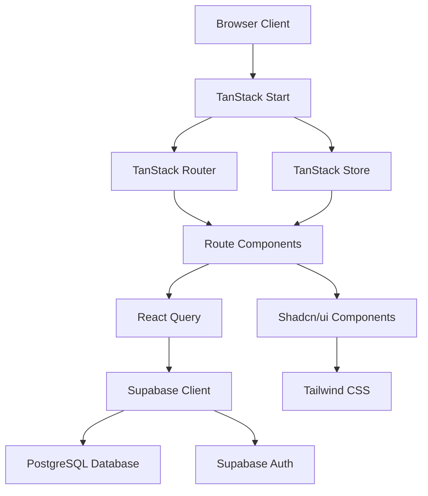

# Introduction

ClubConnect UK is a comprehensive club management platform designed to streamline the administration of extracurricular clubs in UK schools. Built with modern web technologies, it provides a powerful solution for managing teachers, cover assignments, scheduling, and communications.

## What is ClubConnect UK?

ClubConnect UK helps school administrators efficiently manage their extracurricular club programs by:

- **Managing Teachers**: Maintain detailed profiles with teaching styles, availability, and documentation
- **Scheduling Covers**: Create recurring club sessions with flexible scheduling (weekly, bi-weekly, monthly)
- **Assigning Staff**: Match teachers to cover assignments with invitation workflows
- **Broadcasting Messages**: Send multi-channel communications (email/SMS) to teachers
- **Tracking Activity**: Monitor club participation, cover requests, and assignment statuses

## Key features

<CardGroup cols={2}>
  <Card title="Teacher Management" icon="user-group">
    Complete teacher profiles with contact information, teaching styles, documents, and blocking capabilities for unavailable staff.
  </Card>
  
  <Card title="Cover Scheduling" icon="calendar">
    Create recurring cover rules with multiple frequency options (weekly, bi-weekly, monthly) and automatically generate occurrences.
  </Card>
  
  <Card title="Smart Assignments" icon="clipboard-check">
    Invite teachers to cover assignments with status tracking (invited, accepted, declined, confirmed) and response timestamps.
  </Card>
  
  <Card title="Multi-Channel Broadcasts" icon="megaphone">
    Send targeted messages via email or SMS with template support, recipient tracking, and delivery status monitoring.
  </Card>
  
  <Card title="Real-Time Dashboard" icon="chart-line">
    View KPIs including active clubs, open cover requests, active teachers, and message success rates at a glance.
  </Card>
  
  <Card title="Document Management" icon="file-text">
    Store and organize teacher files, system templates, and sent attachments with versioning and archival.
  </Card>
</CardGroup>

## Tech stack

ClubConnect UK leverages cutting-edge technologies to deliver a fast, reliable, and maintainable platform:

### Frontend Framework

<CodeGroup>
```json package.json
{
  "dependencies": {
    "@tanstack/react-start": "^1.132.0",
    "@tanstack/react-router": "^1.132.0",
    "@tanstack/react-query": "^5.66.5",
    "react": "^19.2.0",
    "react-dom": "^19.2.0"
  }
}
```
</CodeGroup>

- **TanStack Start**: Full-stack React framework with SSR support
- **TanStack Router**: Type-safe file-based routing with data loading
- **TanStack Query**: Powerful data fetching and caching
- **TanStack Store**: Lightweight state management
- **React 19**: Latest React with improved performance

### Backend & Database

- **Supabase**: PostgreSQL database with real-time subscriptions
- **Row Level Security**: Secure data access at the database level
- **PostgreSQL 17**: Advanced database features and performance
- **Supabase Auth**: Built-in authentication and session management

### UI & Styling

- **Tailwind CSS 4**: Utility-first CSS framework
- **Radix UI**: Accessible component primitives
- **Shadcn/ui**: Beautiful pre-built components
- **Lucide Icons**: Consistent icon system
- **Huge Icons**: Additional iconography

### Developer Experience

- **TypeScript**: End-to-end type safety
- **Vite**: Lightning-fast build tool
- **Vitest**: Unit testing framework
- **ESLint & Prettier**: Code quality and formatting
- **pnpm**: Fast, disk-efficient package manager

## Platform capabilities

### School & Club Management

Manage multiple schools with individual clubs under each institution. Each club has unique identifiers and can have multiple cover rules for different time slots.

<Accordion title="Database Schema: Schools & Clubs">
```sql
CREATE TABLE schools (
    id UUID PRIMARY KEY,
    school_name VARCHAR(255) NOT NULL,
    address TEXT,
    status school_status DEFAULT 'active'
);

CREATE TABLE clubs (
    id UUID PRIMARY KEY,
    school_id UUID REFERENCES schools(id),
    club_name VARCHAR(255) NOT NULL,
    club_code VARCHAR(50) NOT NULL
);
```
</Accordion>

### Cover Rules & Occurrences

Define recurring cover schedules with specific days, times, and frequencies. The system automatically generates individual occurrences for assignment.

<Info>
  **Frequency Options**: Weekly, bi-weekly, or monthly schedules with day-of-week specification and time ranges.
</Info>

### Teacher Assignments

Invite teachers to specific cover occurrences and track their responses through a complete workflow:

1. **Invited**: Initial invitation sent
2. **Accepted**: Teacher confirms availability
3. **Declined**: Teacher cannot attend
4. **Pending**: Awaiting response
5. **Confirmed**: Final confirmation by admin

### Broadcasting System

Send messages through email or SMS channels with:

- Template-based messaging
- Assignment-specific notifications
- Recipient count tracking
- Status monitoring (draft, sending, completed, failed)
- External ID tracking for Resend/Twilio integration

## Architecture overview

ClubConnect UK follows a modern full-stack architecture:



<Note>
  The application uses server-side rendering for initial page loads and client-side navigation for seamless transitions.
</Note>

## Next steps

<CardGroup cols={2}>
  <Card title="Quickstart" icon="rocket" href="/quickstart">
    Get your development environment up and running in minutes
  </Card>
  
  <Card title="Installation" icon="download" href="/installation">
    Detailed setup instructions for all prerequisites and configurations
  </Card>
</CardGroup>
